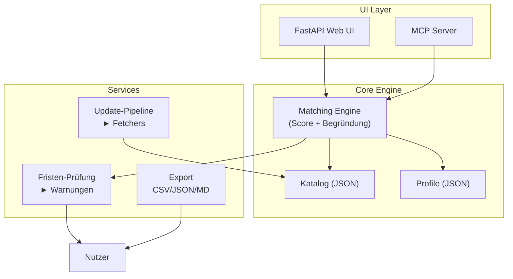

# Förder-Radar – Grant Intelligence

> **Status:** Produktionsreif (lokaler MVP). FLASH-Einreichung abgegeben (2026-08).
> Open Source (MIT). 97 Programme, 245 Tests, 100% Coverage.

**Kern-These:** Es fehlt nicht an Förderangeboten (DFG, ERC, …), sondern an der
Übertragung auf *dein* Profil – und an der einzigen Zahl, die zählt: **deine Fristen**.

Förder-Radar ist ein **fristgesteuerter, profilbasierter Fördermittel-Monitor** –
für die eigene Fakultät/Pilot gedacht, auf offiziellen Quellen, mit transparenter
Begründung („Warum passt das?") und einer Deadline-Pipeline statt Meisterflut aus
Abo-Datenbanken.

---

## Schnellstart

```bash
cd mcp && pip install -r requirements.txt
python3 demo.py                      # Agent-Schleife
uvicorn app:app --port 8000          # UI: http://127.0.0.1:8000
python3 brief.py --felder Biologie --karriere postdoc
```

## Was es kann

| Feature | Beschreibung |
|---------|--------------|
| **Profil-Matching** | Top-5 Programme basierend auf Forschungsfeldern + Karrierestufe |
| **Fristen-Warnungen** | Automatische Alert-Generierung für bevorstehende Deadlines |
| **Wochen-Brief** | Markdown-Brief mit Top-Matches und Fristen-Übersicht |
| **Export** | CSV, JSON, Markdown für weitere Verarbeitung |
| **Update-Pipeline** | Automatisches Fetching + manuelle Portal-Checks |
| **MCP-Server** | Agent-fähige Tools (ingest, search, match, notify) |

## Profile

Profile können **öffentlich** oder **privat** gepflegt werden:

| Datei | Sichtbarkeit | Zweck |
|-------|-------------|-------|
| `mcp/profiles.json` | öffentlich (im Repo) | Pilot- und Nutzer-Profile, die per Merge Request hinzugefügt werden |
| `mcp/profiles.local` | privat (gitignored) | Profile, die nicht öffentlich geteilt werden sollen |

```bash
# öffentlich: Profil hinzufuegen → MR einreichen
# bearbeite mcp/profiles.json, committe und reiche einen Merge Request ein

# privat: lokale Kopie anlegen
cp mcp/profiles.local.example mcp/profiles.local
# bearbeite mcp/profiles.local (wird nie ins Repo aufgenommen)
```

Jedes Profil benötigt `einwilligung: true` für Matching. Optional: ORCID iD für
automatischen Abruf von Publikationen (ORCID Public API). Details in
[`mcp/profiles.local.example`](mcp/profiles.local.example).

**ORCID-Integration:** `fetch_orcid()` ruft Publikationen von der ORCID Public
API ab (mit Einwilligung). `derive_themen()` leitet Forschungsfelder aus
Publikationstiteln ab. Ohne Einwilligung: kein Abruf, kein Matching.

**Pilot (Fachbereich Mathematik):** 3 Profile in `profiles.json` (1 aktiv,
2 Platzhalter). Pilot-Demo: `python3 mcp/pilot_demo.py` → `docs/pilot-ergebnisse.md`.

## Architektur (vereinfacht)



**Details:**
- `docs/Architektur.md` – Bausteine, Datenquellen, Datenmodell
- `docs/Datenquellen.md` – Verifizierte Quellen + Verarbeitungsregeln
- `docs/MCP-Design.md` – MCP-Server-Konzept und Tool-Referenz
- `docs/Dashboard.md` – Statisches GitHub-Pages-Dashboard (Alpine.js + Chart.js)
- `mcp/README.md` – Quickstart, Tools, Cron

## Dashboard

Statisches Dashboard auf GitHub Pages – kein Server, kein Build-Step:

> **Live:** <https://tobias-weiss-ai-xr.github.io/grant-intelligence/>

```bash
bash dashboard/sync-data.sh     # Daten synchronisieren (DSGVO-gefiltert)
cd dashboard && python3 -m http.server 8080   # Lokal testen
```

Features: Katalog-Explorer (97 Programme), Quellen-Browser (26 Quellen),
Kategorie/Status-Charts, Fristen-Timeline, Profil-Matcher (client-seitig).
Siehe [`docs/Dashboard.md`](docs/Dashboard.md).

## Prinzipien

| Prinzip | Bedeutung |
|---------|-----------|
| **Offizielle Quellen** | Keine toten Fristen; jedes Datum mit `standDatum` |
| **Transparenz** | Jede Zuordnung mit menschlesbarer Begründung |
| **Human-in-the-loop** | Scores sind Orientierung, die Person entscheidet |
| **Nachhaltigkeit** | Update-Pipeline statt manueller Eintragungen |
| **Datenschutz** | Einwilligung für Profildaten (ORCID, Publikationen), DSGVO-fähig |
| **Kleiner Einstieg** | Eine Fakultät, eine Persona, ausgewählte Programmfamilien |
| **Open Source** | MIT-Lizenz; Mitmachen per Merge Request |

## Dokumentation

| Datei | Zweck |
|-------|-------|
| `docs/Konzept.md` | Problem, These, Scope, Nutzen |
| `docs/Architektur.md` | Bausteine, Datenquellen, Datenmodell |
| `docs/MCP-Design.md` | MCP-Server-Konzept und Tool-Schema |
| `docs/MVP-Demo.md` | Demo-Skizze (was der Prototyp zeigt) |
| `docs/Wettbewerb.md` | Kompetitive Landschaft |
| `docs/Datenquellen.md` | Verifizierte Quellen + Aktualisierungsregeln |
| `docs/Einreichung.md` | FLASH-Einreichungstext |
| `docs/Promo.md` | PR-/Promo-Material (Pitch, Posts, Poster, Demo-Skript) |
| `docs/Promo-EN.md` | Promo-Material auf Englisch (Pitch, One-Pager, Posts) |
| `docs/Roadmap.md` | Vision: Nah / Mitte / Fern |
| `docs/SPEC-Update-Pipeline.md` | Update-Pipeline-Spezifikation |
| `docs/update_log.md` | Audit-Trail aller Katalog-Updates |

## Update-Pipeline

```bash
# Fristen-Prüfung (wöchentlich per Cron)
python3 mcp/update_catalog.py --check-expired

# Manuelles Portal-Update (monatlich)
python3 mcp/update_catalog.py --validate

# Export für weitere Verarbeitung
python3 mcp/export.py --format csv --out docs/export.csv
```

**Cron-Beispiel:**
```
0 6 * * 0  cd /opt/git/grant-intelligence/mcp && python3 update_catalog.py --check-expired
```

## Ingestion-Pipeline

Registry-basierte, erweiterbare Ingestion mit 7 Fetchern (OpenAIRE, NIH, NSF, Crossref, BMBF, COST, EU):

```bash
# Alle Fetcher auflisten
python3 mcp/ingest.py --list

# Einzelnen Fetcher testen (Dry-Run, kein Schreiben)
python3 mcp/ingest.py --source openaire

# In Katalog importieren
python3 mcp/ingest.py --source openaire --apply

# Alle Fetcher ausführen
python3 mcp/ingest.py --all --apply
```

Neue Quelle hinzufügen = eine Funktion + `@register`-Decorator in `mcp/ingest.py`.

## Verwandt

Konzept-Ursprung im Repo [mafex-flash](https://github.com/tobias-weiss-ai-xr/mafex-flash)
(eine unter mehreren Kandidaten-Ideen).
