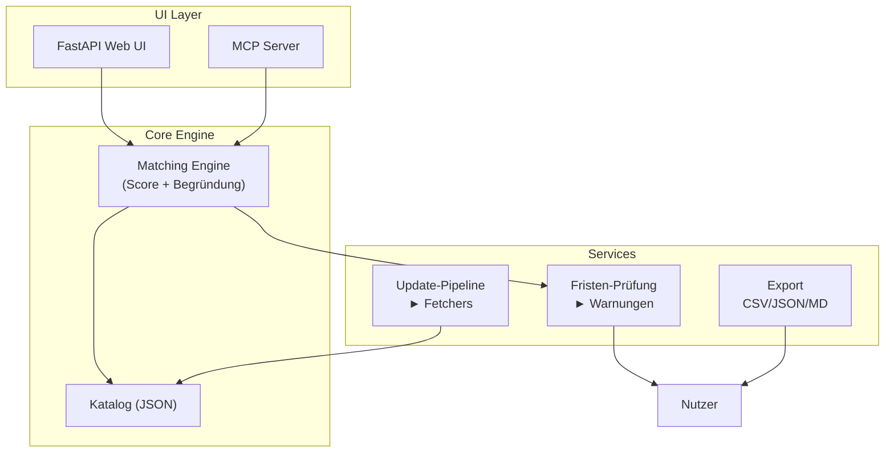

# Förder-Radar – Grant Intelligence

> **Status:** Produktionsreif (lokaler MVP). FLASH-Einreichung abgegeben (2026-08).
> Ein laufender Prototyp mit offiziellen, verifizierten Quellen.

**Kern-These:** Es fehlt nicht an Förderangeboten (DFG, ERC, …), sondern an der
Übertragung auf *dein* Profil – und an der einzigen Zahl, die zählt: **deine Fristen**.

Förder-Radar ist ein **fristgesteuerter, profilbasierter Fördermittel-Monitor** –
für die eigene Fakultät/Pilot gedacht, auf offiziellen Quellen, mit transparenter
Begründung („Warum passt das?") und einer Deadline-Pipeline statt Meisterflut aus
Abo-Datenbanken.

---

## Schnellstart

```bash
cd mcp && pip install -r requirements.txt
python3 demo.py                      # Agent-Schleife
uvicorn app:app --port 8000          # UI: http://127.0.0.1:8000
python3 brief.py --felder Biologie --karriere postdoc
```

## Was es kann

| Feature | Beschreibung |
|---------|--------------|
| **Profil-Matching** | Top-3 Programme basierend auf Forschungsfeldern + Karrierestufe |
| **Fristen-Warnungen** | Automatische Alert-Generierung für bevorstehende Deadlines |
| **Wochen-Brief** | Markdown-Brief mit Top-Matches und Fristen-Übersicht |
| **Export** | CSV, JSON, Markdown für weitere Verarbeitung |
| **Update-Pipeline** | Automatisches Fetching + manuelle Portal-Checks |
| **MCP-Server** | Agent-fähige Tools (ingest, search, match, notify) |

## Architektur (vereinfacht)



**Details:**
- `docs/Architektur.md` – Bausteine, Datenquellen, Datenmodell
- `docs/Datenquellen.md` – Verifizierte Quellen + Verarbeitungsregeln
- `mcp/README.md` – MCP-Server-Details und Tool-Referenz

## Prinzipien

| Prinzip | Bedeutung |
|---------|-----------|
| **Offizielle Quellen** | Keine toten Fristen; jedes Datum mit `standDatum` |
| **Transparenz** | Jede Zuordnung mit menschlesbarer Begründung |
| **Human-in-the-loop** | Scores sind Orientierung, die Person entscheidet |
| **Nachhaltigkeit** | Update-Pipeline statt manueller Eintragungen |
| **Datenschutz** | Einwilligung für Profildaten (ORCID, Publikationen), DSGVO-fähig |
| **Kleiner Einstieg** | Eine Fakultät, eine Persona, ausgewählte Programmfamilien |

## Dokumentation

| Datei | Zweck |
|-------|-------|
| `docs/Konzept.md` | Problem, These, Scope, Nutzen |
| `docs/Architektur.md` | Bausteine, Datenquellen, Datenmodell |
| `docs/MVP-Demo.md` | Demo-Skizze (was der Prototyp zeigt) |
| `docs/Wettbewerb.md` | Kompetitive Landschaft |
| `docs/Datenquellen.md` | Verifizierte Quellen + Aktualisierungsregeln |
| `docs/Einreichung.md` | FLASH-Einreichungstext |
| `docs/SPEC-Update-Pipeline.md` | Update-Pipeline-Spezifikation |
| `docs/update_log.md` | Audit-Trail aller Katalog-Updates |
| `mcp/README.md` | MCP-Server, Matching, UI, Brief-Details |

## Update-Pipeline

```bash
# Fristen-Prüfung (wöchentlich per Cron)
python3 mcp/update_catalog.py --check-expired

# Manuelles Portal-Update (monatlich)
python3 mcp/update_catalog.py --validate

# Export für weitere Verarbeitung
python3 mcp/export.py --format csv --out docs/export.csv
```

**Cron-Beispiel:**
```
0 6 * * 0  cd /opt/git/grant-intelligence/mcp && python3 update_catalog.py --check-expired
```

## Status

- **Tests:** 112/112 bestanden
- **Katalog:** 75 Programme (ERC, DFG, BMBF, EU, Stiftungen, Land, Industrie, Bund, International)
- **Karriere-Level:** postdoc, junior, prof, senior, student, verwaltung, service, IT, bibliothek
- **Student-Grants:** 19 Programme (Deutschlandstipendium, 11 Begabtenförderungswerke, DAAD, Erasmus+, Max Weber)
- **PhD/Grad-Colleges:** DFG GK/IRTG/Graduate School, MSCA ITN/COFUND
- **Postdoc-Grants:** DFG Walter Benjamin (Rueckkehr/Neueinstieg, rolling), ERC StG/CoG/AdG/SyG, DFG Emmy Noether/Heisenberg, DAAD, MSCA ITN/COFUND, Gerda Henkel, Fritz Thyssen
- **Export:** CSV, JSON, Markdown
- **Fetchers:** COST, EU Horizon, BMBF RSS (mit auto-Persist via `apply_fetch_updates`)
- **Deadline-Cron:** `cron_check_expired.sh` (systemd-Timer/Crontab empfohlen)

## Verwandt

Konzept-Ursprung im Repo [mafex-flash](https://github.com/tobias-weiss-ai-xr/mafex-flash)
(eine unter mehreren Kandidaten-Ideen).
